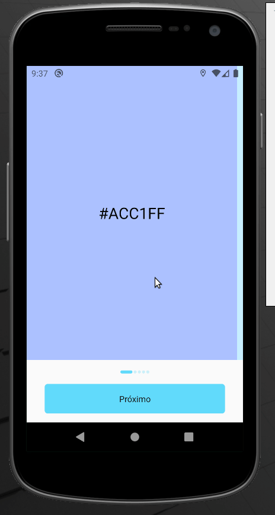

# Simple Carousel

This project was developed using react native and Animated lib to simulate a onboarding screen. 

## Prerequisites

Node 8.10.0 or later on your local development machine

## Installing

* First you should clone this repository on your machine;
* Go to the project directory with the `cd react-native-simple-carousel` command;
* After that install the project dependencies using `npm install` or` yarn install`;
* Now run the project using `npm start` or `yarn start` and `yarn android`;

## License

This project is licensed under the MIT License - see the [LICENSE.md](LICENSE) file for details
